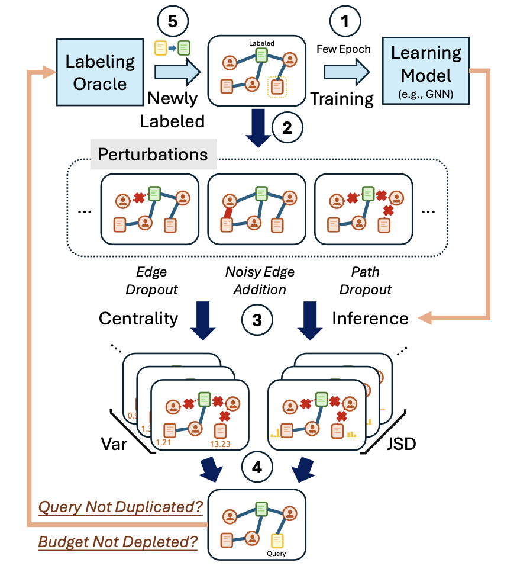

[4] Perturbation-based Graph Active Learning for Semi-Supervised Belief Representation Learning

Dachun Sun, Jinning Li, Xinyi Liu, You Lyu, Hongjue Zhao, Denizhan Kara and Tarek Abdelzaher

*ICCCN 2025*

 