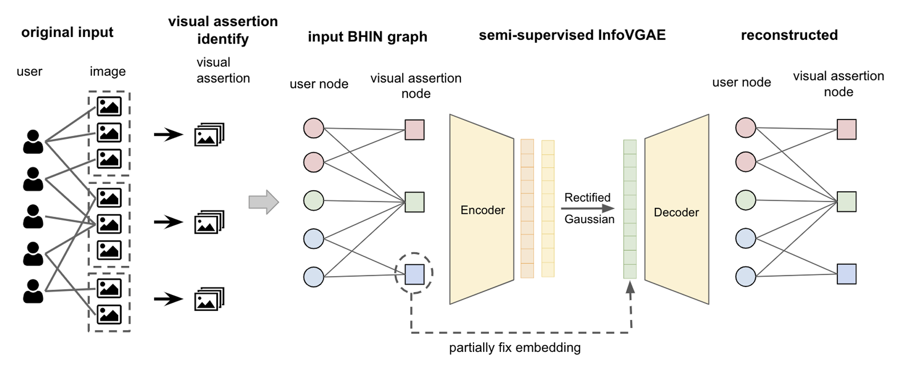

[7] Unsupervised Image Classification by Ideological Affiliation from User-Content Interaction Patterns

Xinyi Liu, Jinning Li, Dachun Sun, Ruijie Wang, Tarek Abdelzaher, Matt Brown, Anthony Barricelli, Matthias Kirchner, Arslan Basharat

*ICWSM workshop 2023*

 